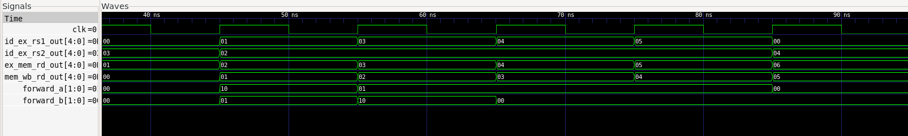
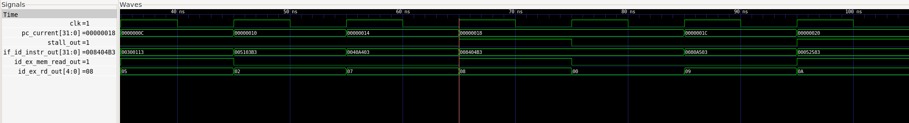
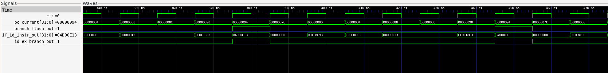

# RISC-V CPU: A 5-Stage Pipelined RV32I Core

A pipelined RV32I RISC-V processor built from scratch in Verilog, alongside a complete single-cycle implementation kept as a permanent reference, and a core architecture deliberately designed to grow into a microcontroller.

---

## Table of Contents

- [Overview](#overview)
- [Results](#results)
- [Architecture](#architecture)
- [The Pipeline in Depth](#the-pipeline-in-depth)
- [What is RV32I](#what-is-rv32i)
- [Extensibility](#extensibility)
- [Verification / Testing](#verification--testing)
- [Build & Run](#build--run)
- [Future Work / Limitations](#future-work--limitations)

## Overview

This repository contains a fully pipelined RV32I RISC-V processor, implemented from the ground up in Verilog. It is accompanied by a complete single-cycle implementation of the same instruction set, not an early draft that was abandoned once the pipeline worked, but a finished, independently tested core that exists on purpose, as the baseline every pipelining decision was measured against.

The core is the product of a deliberate progression, not an isolated exercise: gates, multiplexers, decoders, adders, comparators, flip-flops, counters, a register file, FSMs, and a small ALU were built first as reusable building blocks (see `verilog-fundamentals/`), with the CPU itself assembled only once that foundation was solid.

Three things distinguish this project from a typical from-scratch RV32I build:

**The hazards are actually solved.** A pipelined datapath is not a working pipelined CPU until data and control hazards are handled correctly. This core implements a full forwarding unit (EX/MEM and MEM/WB into EX), load-use hazard detection with stall and bubble insertion, and branch/jump flushing across all six branch types plus JAL and JALR, each verified against dedicated hazard test programs, not assumed correct by inspection.

**Two cores, not one.** Building the pipeline second, with the single-cycle core still intact and runnable, means every claim about the pipeline's cost and benefit is backed by a direct one to one comparison rather than a single number in isolation.

**It's built to be extended, not just finished.** The core communicates with memory exclusively through a single address-decoded interface, with an address range permanently reserved for memory-mapped peripherals. Nothing here assumes the CPU is the whole system, it's designed as the starting point for one.

---

## Results

A single-cycle CPU pays a fixed cost on every instruction: the clock period has to be long enough for the slowest instruction in the entire ISA to finish, which means a simple register-to-register `addi` sits idle for the same window a full memory load needs to complete. Pipelining exists to close that gap, different instructions occupy different stages simultaneously, so the clock only has to be as long as the slowest *single stage*, not the slowest *entire instruction*.

| Metric | Single-Cycle | Pipelined |
|---|---|---|
| CPI | 1.000 | 1.134 |
| Critical path (synthesis) | 2.70 ns | *not reliable, see note below* |

CPI was measured directly via `tb/core/cpi_tb.v` across the project's test programs. The single-cycle result of 1.000 is architectural, not measured behavior: by construction, exactly one instruction retires every cycle, no exceptions. The pipelined result of 1.134 is the real, measured cost of correctness: every load-use stall and every flushed branch or jump shows up in that number as overhead above the ideal CPI of 1.0.

**A note on timing.** The single-cycle critical path of 2.70 ns comes from a full synthesis and static timing analysis flow (Yosys, OpenSTA, Nangate45 standard cells) and is solid enough to cite directly. The same flow run against the pipelined core reports figures in the 7 to 9 ns range, and that number is not trustworthy. It's an artifact of unbuffered high-fanout nets in the synthesis output, not a measurement of how fast the pipelined design actually runs. Rather than present a number that looks precise but isn't, this is documented as an open limitation. See [Future Work / Limitations](#future-work--limitations).

The honest takeaway: pipelining here costs roughly 13% in CPI to buy the ability to run at a fundamentally higher clock frequency, a trade that only pays off once the clock speedup from shorter per-stage logic outweighs that 13%, which single-stage synthesis alone can't yet confirm for this design.

## Architecture

Both cores share the same five-stage breakdown of work: fetch, decode, execute, memory, writeback, they differ only in whether that work happens in one clock cycle or is split across five overlapping ones. The diagrams below show each version's datapath, followed by a note on how the core reaches memory and where peripherals will eventually plug in.

### Single-Cycle Datapath



Every instruction moves through all five stages combinationally within a single clock edge: `regfile` reads and `alu_32` computes in the same cycle that `branch_comp` resolves a branch and feeds `pc` directly, with no pipeline registers, no hazards, and no forwarding required anywhere. The tradeoff is that the clock period has to accommodate the slowest instruction in the ISA: a load, which touches every stage, even when running something as simple as `addi`.

### Pipelined Datapath



The pipelined version breaks that same datapath into five stages separated by pipeline registers — `if_id_reg`, `id_ex_reg`, `ex_mem_reg`, `mem_wb_reg`, allowing up to five instructions to be in flight at once. The overlap isn't free: the orange blocks are what pay for it. `hazard_detect` freezes fetch and decode for a cycle whenever a load's result isn't available yet, and `forwarding_unit` reroutes ALU results and load data back into the execute stage before they've reached the register file, avoiding a stall wherever forwarding alone can resolve the dependency.

### Memory and the Path to Extensibility

Both cores reach memory through the same seam. `mem_interface.v` sits between the core's memory port and the data RAM, and every load, store, and instruction fetch passes through it rather than touching RAM directly. Today it decodes exactly two ranges: `0x0000_0000` to `0x0000_0FFF` forwards to the 4KB data RAM, and everything at `0x1000_0000` and above is reserved and stubbed out. Nothing lives in that upper range yet, but because every memory access already flows through this one decoder, adding a peripheral later means writing the peripheral and giving it an address range, not touching the core, the pipeline, or the hazard logic. See [Extensibility](#extensibility) for how that seam is meant to get used.

## The Pipeline in Depth

The five stages shown above aren't new hardware, they're the same modules from the single-cycle core, now separated by pipeline registers so up to five instructions can be in flight simultaneously. **Fetch** reads the next instruction while **Decode** extracts operands and control signals for the instruction one cycle ahead of it, **Execute** runs the ALU or resolves a branch for the instruction two cycles ahead, **Memory** services a load or store for the instruction three cycles ahead, and **Writeback** commits a result to the register file for the instruction that entered the pipeline four cycles earlier. On paper this quadruples throughput. In practice, instructions in flight together aren't independent, one stage's output is often another stage's input before it's actually ready, and handling that correctly is most of what separates a pipelined datapath from a pipelined CPU.

### Forwarding

The common case is a data hazard: an instruction needs a register value that a very recent instruction hasn't written back yet. Stalling until the write actually lands would erase most of the pipeline's benefit, so `forwarding_unit.v` instead intercepts the value one cycle early and routes it directly into the ALU's inputs.

Two sources are checked, both compared by register **address**, not value: `id_ex_rs1`/`id_ex_rs2` (the operands the instruction currently in Execute needs) against `ex_mem_rd` (the destination of the instruction one stage ahead, still sitting in Memory) and `mem_wb_rd` (the destination of the instruction two stages ahead, sitting in Writeback). If both match the same register, EX/MEM wins over MEM/WB, since it's the more recent value. `x0` is excluded from both checks, a write to `x0` never has meaning, so a coincidental address match there would forward a value that doesn't need forwarding at all.

This mechanism resolves the overwhelming majority of data hazards in a single cycle, with no stall and no bubble.

### Load-Use Stalls

Forwarding has one case it structurally cannot fix: a load immediately followed by an instruction that consumes the loaded value. The reason isn't a bug in the forwarding logic, it's timing, `ex_mem_alu_result` only ever holds what the ALU computed in Execute, and for a load that's just the memory *address*, not the data at that address. The real value doesn't exist until Memory actually runs, one cycle later than a back-to-back consumer would need it forwarded.

`hazard_detect.v` catches this case by comparing the load currently in Execute (`id_ex_mem_read`, `id_ex_rd`) against the raw, not-yet-latched operands of the instruction sitting in Decode. On a match, one stall signal does three things at once: `pc.v` holds the current program counter instead of advancing, `if_id_reg.v` holds its output instead of latching the next fetched instruction, and `id_ex_reg.v` is forced into a bubble, an all-zero, no-op instruction, so nothing incorrect enters Execute. One cycle later, the load has reached Memory, its result is available for forwarding, and the stalled instruction proceeds normally.

### Branch and Jump Flushing

Branches and jumps introduce a different kind of hazard: by the time a branch resolves, the pipeline has already speculatively fetched and begun decoding the two instructions immediately after it, assuming execution just continues sequentially. If the branch is taken, those two instructions were fetched from the wrong path entirely and have to be discarded before they can do any damage.

All six branch types (`BEQ`, `BNE`, `BLT`, `BGE`, `BLTU`, `BGEU`) resolve in Execute, alongside `JALR`. `JAL` is the exception, since it's unconditional and needs no register read, it resolves a stage earlier, in Decode. Whichever stage triggers the flush, the same two pipeline registers get cleared: `if_id_reg` (killing the wrong-path instruction still in Fetch) and, for branches and `JALR`, `id_ex_reg` as well (killing the wrong-path instruction that had already reached Decode). `JAL` only needs the one-instruction flush, since nothing wrong has reached Decode yet by the time it resolves.

`JALR`'s target has one additional wrinkle the other three don't: because it's computed as `rs1 + imm` rather than a fixed offset from the program counter, the result can land on an odd address even when the inputs look fine. Since RISC-V instructions are required to be 2-byte aligned, `JALR` forces bit 0 of the computed target to zero before it's used, per spec.

One of these mechanisms surfaced a real bug during development: `hazard_detect.v` originally read `rs1`/`rs2` off a fixed instruction slice regardless of instruction format. `JAL` reads no registers at all, but its immediate happens to occupy exactly the bit positions the decoder was treating as `rs1`, so a load a few instructions earlier could false-trigger a stall against garbage that was never actually a register. The fix gates the stall condition per-operand, checking whether the instruction in Decode genuinely uses `rs1`/`rs2` at all before comparing against them.

## What is RV32I

An Instruction Set Architecture (ISA) is the contract between software and hardware: it defines what instructions exist, what each one does, how many registers are available and how wide they are, how memory is addressed, and how data is represented. RV32I is one such contract, RISC-V's base 32-bit integer instruction set, and the one this core implements in full.

RISC-V is open source, unlike ISAs such as ARM or x86, which carry licensing costs and design constraints tied to a single vendor. That openness is why it has become the ISA of choice for academic projects, startups, and increasingly large-scale industrial and national investment, since anyone can implement it, extend it, or build a career on it without paying to do so.

RISC-V is also a RISC design in the traditional sense: instructions are simple, fixed-width, and uniform, which keeps the hardware that decodes and executes them simple in turn. The tradeoff shows up on the compiler side, since more complex operations have to be built out of several simple instructions rather than handed to the hardware as one. CISC ISAs make the opposite tradeoff, packing more behavior into individual instructions at the cost of a more complex decode and execute path. RV32I's entire instruction count, opcode space, and encoding scheme reflect the RISC side of that tradeoff.

### Registers

RV32I defines 32 general-purpose registers, each 32 bits wide, referenced by both a numeric name (x0 through x31) and a conventional ABI name that signals its intended use:

| Register | ABI Name | Purpose |
|---|---|---|
| x0 | zero | Hardwired to 0, writes are discarded |
| x1 | ra | Return address |
| x2 | sp | Stack pointer |
| x3 | gp | Global pointer |
| x4 | tp | Thread pointer |
| x5–x7, x28–x31 | t0–t6 | Temporaries, caller-saved |
| x8–x9, x18–x27 | s0–s11 | Saved registers, callee-saved |
| x10–x17 | a0–a7 | Function arguments and return values |

x0 is the one register with hardware-enforced behavior: every read returns zero regardless of what's ever been written to it, which turns out to be useful well beyond "the constant zero," since it's what makes unconditional jumps and discarded return addresses expressible without a dedicated instruction for either.

### Instruction Formats

Every RV32I instruction is 32 bits wide and falls into one of six formats, R, I, S, B, U, and J, distinguished by how those 32 bits are divided between opcode, registers, and immediate.

| Format | Used By | Immediate |
|---|---|---|
| R | Register-to-register ops (ADD, SUB, AND, ...) | None |
| I | Immediate ops, loads, JALR | 12 bits, sign-extended |
| S | Stores | 12 bits, split across two fields |
| B | Branches | 13 bits, scrambled and split, implicit 0 bit |
| U | LUI, AUIPC | 20 bits, occupies the upper bits of the result |
| J | JAL | 21 bits, scrambled, implicit 0 bit |

The opcode, rs1, and rs2 fields sit in the same bit positions across every format that uses them. That consistency is deliberate: it lets a decoder start reading register fields the same cycle it's still figuring out the instruction's format, since it doesn't need to know the format first to know where rs1 lives. The immediate is what absorbs the resulting inconsistency, since it gets pushed into whatever bit positions are left over once the fixed fields are accounted for, which is why B-type and J-type immediates in particular end up bit-scrambled rather than contiguous.

A stack, tracked by the sp register and growing downward from a high address, provides temporary storage for function calls, standard practice this core's own test programs (recursion, function calls, loop-carried state) rely on throughout.

## Extensibility

The [Architecture](#architecture) section introduced `mem_interface.v` as the seam every memory access flows through, and the address map it currently enforces: `0x0000_0000` to `0x0000_0FFF` forwards to the 4KB data RAM, everything at `0x1000_0000` and above is reserved and stubbed. This section is about why that seam exists and what it buys.

### Why a decoder instead of direct RAM access

The straightforward way to build this core would have the core's memory port wired straight into the data RAM: one module, one piece of storage, no indirection. That approach works right up until a second thing needs to live on the memory bus, at which point every place the core assumed "memory access equals RAM access" has to be found and rewritten. Routing every load, store, and instruction fetch through `mem_interface.v` instead means the core never makes that assumption in the first place. It hands an address to the decoder and gets data back; what's actually answering on the other side is the decoder's problem, not the core's.

### What adding a peripheral actually looks like

Because that seam already exists, adding a memory-mapped peripheral to this core doesn't touch the CPU, the pipeline, or the hazard logic at all. It's three steps, all of them outside `rtl/core/`:

1. Write the peripheral as a small register-mapped module, some combination of control, status, and data registers exposed on a simple read/write interface.
2. Give it an address range inside `0x1000_0000` and above, and extend `mem_interface.v`'s decode logic to route that range to the new peripheral instead of the stub.
3. Nothing else. No changes to `core_pipelined.v`, no changes to `forwarding_unit.v` or `hazard_detect.v`, no changes to any pipeline register. A store to a peripheral's address looks, from the core's point of view, exactly like a store to RAM.

That last point is the actual payoff of building the seam this way. The core doesn't need to know a peripheral exists to correctly execute an instruction that touches one, because as far as the core is concerned, it never stopped talking to `mem_interface.v`.

### The path to a microcontroller

Today the MMIO range is reserved but empty, a stub that silently drops writes and returns zero on reads. That's a deliberate placeholder, not a limitation to work around, since the goal for v1.0 was proving the seam exists and behaves correctly, not populating it. The natural next step, out of scope for this repository but the direct motivation for building things this way, is a UART peripheral mapped into that reserved range, followed by I2C/I3C, a timer, and GPIO, each occupying its own slice of the address space the decoder already knows to route correctly. At that point this stops being a CPU core with a stubbed-out feature and becomes a small microcontroller, without ever having required a rewrite of the part that took the longest to get right.

## Verification / Testing

Every instruction in this core was proven working through the actual execution path, core through `mem_interface.v` through `data_mem.v`, or through real PC redirection for control flow, rather than trusted from a single passing testbench in isolation. Verification happened in two distinct passes across the project: instruction-category testing on the single-cycle core, then hazard-mechanism stress testing once the pipeline existed.

### Single-cycle: one instruction category at a time

Phase 3 worked through the ISA category by category rather than testing everything at once: R-type, I-type arithmetic, loads, stores, branches, then jumps and upper immediates, each with its own dedicated test program and testbench. Two techniques carried across every category:

Loads and stores were verified against each other rather than trusted independently, stores were checked by reading the written value back with an already-proven load, and loads were checked against memory preloaded directly through the testbench, sidestepping any assumption that stores worked before they'd been tested.

Branches don't write a register on their own, so a register value after a branch tells you nothing about whether the branch actually fired. Branch tests instead used a sentinel-marker technique: a `111` marker planted on the fall-through path, a `222` marker at the taken target, and a `jal` immediately after the fall-through marker so execution couldn't accidentally slide into the taken marker regardless of which path the branch actually took. Whichever marker landed in a register proved which path the PC actually went down.

This pass caught one real RTL bug: `core.v`'s store-data path wasn't positioning `rs2_data` into the correct byte lane before handing it to `data_mem.v`, so `sb` and `sh` at non-zero lane offsets silently wrote to the wrong bits. The fix was a dedicated `mem_wdata_r` positioning mux, mirroring the load-side extension logic that already existed in the opposite direction.

### Pipeline: stress-testing each hazard mechanism

Getting a hazard mechanism to pass once on a single demo case and getting it to hold up in general are different claims, and the pipeline testing phase treated them that way. Each mechanism, forwarding, the load-use stall, and branch/jump flushing, got a dedicated stress-testing pass after its initial implementation:

Forwarding was tested against a chain of back-to-back dependent instructions (forcing the forward-select signal to change every cycle), two independent producers feeding a single consumer's two operands simultaneously, and a deliberate tie between EX/MEM and MEM/WB both matching the same destination register, to prove the priority logic picks the more recent value rather than passing by coincidence.

The load-use stall was tested across six scenarios: a load feeding rs2 instead of rs1, a load feeding both operands of the same consumer, a chained load-use where a load's result becomes the address of the next load, a negative case (gap sufficient for forwarding alone, confirming the stall doesn't fire when it shouldn't), a load feeding directly into a branch, and two independent load-use hazards placed back-to-back.

Branch and jump flushing was tested across all six branch types plus JAL and JALR, deliberately including a case where signed and unsigned comparison disagree on identical operands (`BLT` taken, `BLTU` not taken, same bit pattern), and a real backward-branching loop, since every prior test had only ever jumped forward and a redirect that silently only handled positive offsets would have passed every one of them.

The single hardest class of bug to catch here wasn't in any of these mechanisms individually, it was gaps between them: `branch_comp` initially had no forwarding path at all despite the ALU's forwarding infrastructure already existing, and `ex_mem_reg`'s store-data path was wired to the raw, unforwarded register read rather than the forwarded value, meaning stores could silently write stale data. Both were the same shape of bug: forwarding existed, it just hadn't been wired to every consumer that needed it, and both were only found by writing tests that printed the actual internal signal values (`rs1_data`, `rs2_data`) rather than trusting a final register-state check that could pass on accidentally-correct data.

### Waveforms



`core_pipelined_forwarding_tb.v`'s Section A: three back-to-back dependent `add` instructions, each one cycle behind the one feeding it. Watch `forward_a` flip between `01` (EX/MEM) and the no-forward case as the producing instruction moves further from EX each cycle.



`hazard_scenarios_test.hex` hitting Scenario 1: a load immediately followed by a consumer. `stall` pulses high for one cycle, `pc_current` and `if_id_instr_out` hold steady across that cycle, and `id_ex_reg`'s outputs zero out into a bubble before the consumer is allowed to proceed.



`core_pipelined_branch_scenarios_tb.v`'s backward-branch loop: `branch_flush_out` pulses high on each taken iteration, and the instruction that had already been speculatively fetched down the fall-through path never reaches EX.

## Build & Run

### Toolchain

- Icarus Verilog 12 (`iverilog`, `vvp`)
- GTKWave, for waveform inspection
- WSL2 / Ubuntu
- VS Code

### Compiling and running a testbench

```bash
iverilog -o sim tb/core/<testbench>.v rtl/core/*.v && vvp sim
```

Most testbenches instantiate `core_pipelined.v` (or `core.v` for the single-cycle reference) directly alongside `instr_mem.v` and `mem_interface.v`, so compiling just needs every file under `rtl/core/` plus the specific testbench being run.

One thing worth knowing before trusting a run: `rtl/core/instr_mem.v` loads its program via a hardcoded `$readmemh` path. Repointing it at a different `.hex` file and recompiling is required before rerunning any test with a new program, and the simulator's `WARNING` line about the `$readmemh` range is the fastest way to confirm the path was actually updated.

### Worked Example

Running the full pipelined core against a real program, not just a hazard-isolation test, end to end:

```bash
iverilog -o sim tb/core/core_pipelined_fib_tb.v rtl/core/*.v && vvp sim
```

```
WARNING: rtl/core/instr_mem.v:13: $readmemh(programs/handcoded/fib_pipeline.hex): Not enough words in the file for the requested range [0:1023].
x1 (a, fib result) = 55 (expect 55)
x2 (b, fib next term) = 89 (expect 89)
x4 (i, loop counter) = 10 (expect 10)
x5 (N, loop bound) = 10 (expect 10)
```

The `WARNING` line is expected, not a failure — `$readmemh` always reports this since the hex file doesn't fill the full 1024-word instruction memory, and it doubles as confirmation of exactly which program got loaded, worth checking before trusting any result. The four register checks above confirm this iterative Fibonacci program, running through every pipeline hazard mechanism (forwarding, stalling, branch flushing) simultaneously rather than in isolation, produces the same correct result (fib(10) = 55) on the pipelined core as it does on the single-cycle reference.

### Repository Structure

```
risc-v-cpu/
├── rtl/
│   ├── core/          # CPU core: single-cycle (core.v), pipelined (core_pipelined.v),
│   │                  # and every shared module (ALU, regfile, control unit,
│   │                  # pipeline registers, forwarding unit, hazard detect, mem interface)
│   └── soc/           # Top-level wiring: core + instruction memory + memory interface
├── tb/
│   ├── core/          # Per-module and per-stage testbenches, plus pipeline integration
│   └── soc/           # Single-cycle instruction-category testbenches
├── programs/
│   ├── handcoded/     # Hand-encoded and Python-generated .hex programs
│   ├── encoder/       # Python encoder (encoder.py) for generating .hex programs
│   └── generated/     # .hex output from the encoder
├── docs/
│   ├── isa/                  # RV32I ISA notes and assembly practice
│   ├── pipeline/             # Pipeline construction, hazard, and performance notes
│   ├── single-cycle/         # Single-cycle architecture and testing notes
│   ├── verilog-fundamentals/ # Notes from the foundational Verilog phase
│   └── images/                # Architecture diagrams and waveform screenshots
├── verilog-fundamentals/  # Foundational modules (gates, muxes, adders, FSMs, ALU)
│                          # built before the CPU itself, kept as a permanent reference
└── README.md
```

The `verilog-fundamentals/` reorganization (11 topic folders, previously loose at the repo root) reflects the actual order those building blocks were built in during the project's first phase, before any RV32I-specific work began.

## Future Work / Limitations

**Pipelined critical path is unverified.** The single-cycle core's 2.70ns critical path comes from a real synthesis and static timing analysis flow (Yosys, OpenSTA, Nangate45) and is solid enough to cite directly. The same flow run against the pipelined core reports figures in the 7 to 9ns range, and that number is not trustworthy, it's an artifact of unbuffered high-fanout nets coming off the IF/ID pipeline register, not a measurement of how fast the design actually runs. A correct fix requires a max-fanout constraint applied before synthesis, not retrofitted onto the existing netlist afterward. This is a known toolchain gap (no buffer insertion, no place-and-route), not a flaw in the CPU design itself, and it means the "shorter clock period offsets more cycles" half of the pipelining argument can't be demonstrated with real numbers from this flow. The CPI comparison in [Results](#results) remains the only solid measured number on that tradeoff.

**No peripherals exist yet.** The MMIO address range (`0x1000_0000` and above) is reserved and routed correctly by `mem_interface.v`, but nothing currently lives there beyond a stub that drops writes and returns zero on reads. UART, I2C/I3C, timers, and GPIO are the natural next additions and were deliberately left out of v1.0's scope; see [Extensibility](#extensibility) for what adding one actually involves.

**CPI measurement relies on a heuristic, not a dedicated valid signal.** Retired-instruction counting treats any cycle where `id_ex_reg_write`, `id_ex_mem_write`, `id_ex_branch`, or `id_ex_jump` is high as a real instruction in EX. This is accurate for every program in this repository, but an unmapped opcode would produce the same all-zero signature as a bubble under this method, since `control_unit.v`'s default case zeroes the same four signals a flush does. A general solution would thread a dedicated valid bit through every pipeline register rather than reusing existing control signals for double duty; that wasn't built here since no test program in this project exercises an unmapped opcode.

**Single-cycle completion detection is program-specific.** `single_cycle_cycles_tb.v` detects program completion via a fixed landmark PC address rather than a general halt signal, which works cleanly for `fib_pipeline.hex`'s fully static control flow but would need a dedicated halt instruction or signal to generalize to a program whose exit point isn't known ahead of time.