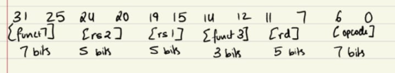
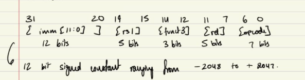
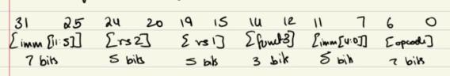
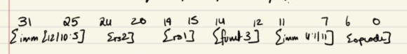
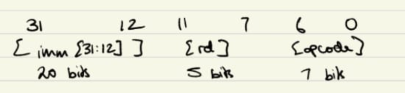
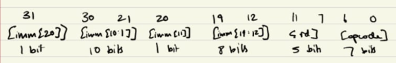

# Phase 2: Personal Notes for my RV32I learning journey.

## DAY 15: Introduction to ISA and Registers

### What is an ISA?
- An ISA (Instruction Set Architecture) is like a contract between the software and the hardware it tells what instructions exist and what they do , how many registers exist and how wide each of them are , how the memory is addressed and also how the data is represented. RISC-V for example is a open source ISA other examples are ARM and x86.

### What is RV32I?
- RV - RISC V
- 32 - 32 bit registers and address space
- I - base integer instruction set

### Why are you using RISC-V?
- Eventhough other ISA's exist RISC-V is the only open source one and is being heavily researched and expanded at the time by startups, people, companies, countries like India and China are heavily investing in it as it has no licensing fee required and ordinary learners like myself can use it to learn and develop.

### RISC vs CISC?
- They both are built on opposite philosophies RISC means the instructions are simple and standard allowing the hardware to be more simple in turn the compiler has a bit more work to do and for more complex tasks the instructions are to be compounded.
- In CISC the instructions tend to be complex as in multiple cycles and harder tasks making the compilers job easier in turn the hardware becomes a lot more complex as you need special circuitry to support such instructions.

### What are your 32 registers? (Using actual register/ABI)
- x0/zero : holds the value zero at all times cannot be written to and is helpful is many tasks inculding transferring values between registers.
- x1/ra : return address is held over here so we can jump back after a function call.
- x2/sp : tracks the top of the stack helping it grow and shrink.
- x3/gp : global pointer , points to the middle of the region of memory that hold global variables.
- x4/tp : thread pointer yet to fully understand what this does.
- t0-t6 (x5-x7 --> t0-t2 and x28-x31 --> t3-t6): these are temporaries they are registers that act as scratchpads as in functions can change and manipulate values within them to their liking.
- s0-s11 (x8-x9 --> s0-s1 and x18-x27 --> s2-s11): these are saved registers here the values can be chnaged within the function but before returing the intial value at function call must be restored within these registers.
- a0-a7 (x10-x17 --> a0-a7): these are argument registers they are used for passing function arguments and also the return value returns through a0.

### What do you know about the stack till now?
- The stack is a region of the memory that grows and shrinks while your program runs. Whenever you call a function it requires temporary space for it's local variables. That space is given by the stack and the when the function ends that space is then given back.

## DAY 16: Instruction Formats

### What are the 6 Formats and why are they needed?
- The six formats are R , I , S , B , U , J. They are needed because there are many types of instructions in the RISC-V ISA and all of them have different needs and thus to make sure that every instruction is 32 bits long all their needs are attended to and the hardware is as simple as possible we have these 6 types of instruction formats.

### R-type instructions (Register to Register)
- These are register to register instructions. So here we need two source registers to do something and we return the result to a destination register.
- Here is an image to show how the bits are allocated:
- 
- opcode tells which family of instruction it is like r-type then funct3 is used to narrow it down to groups within the family and funct7 here does the final narrowing down usually do not need it but in cases like ADD and SUB the SUB has 30th bit as 1 rather than 0 like in ADD thus funct7 plays a role.

### I-type instructions (Immediate operations)
- Rather than two source registers ,this has one register and a constant baked into it directly. The constant is called an immediate.
- Here is an image to show how the bits are allocated:
- 
- The 12 bit immediate is extended to 32 bits using sign extension.
- This does not require funct7 as the opcode and funct3 are enough for distinguishing here.

### S-type instructions (Store instructions)
- It is used for storing data to memory. It basically takes a value sitting in a register and writes it to a memory address (base register + offset).
- Here is an image to show how the bits are allocated:
- 
- The immediate is split as RISC-V is designed in such a way that rs1 and rs2 bit positions should remain the same in all formats this allows the CPU to decode and perform register reading at the same time making it a lot more efficient.

### B-type instructions (Branch instructions)
- These are used for conditional branches --> if some part of the code is correct jump to a different part of the program.
- Here is an image to show how the bits are allocated:
- 
- Unlike S the splitting bits are reordered.
- So upon reassembly the offset would look like:
- 
- Cause of how RISC-V works the target address will always be at a even postion thus we always have a zero at the end giving us a 13 bit offset and more range. Thus to keep S and B as similar as possible and to try and keep the hardware as reused they had to reorder the bits.

### U-type instructions (Upper Immediate)
- The simplest instruction format basically takes a 20 bit immediate and a destination register and just copies the immediate to the top 20 bits of the rd and the rest are zeroes mostly used to copy immediates to registers this instruction gives 20 bits and the rest are from I type.
- Here is an image to show how the bits are allocated:
- 
- Only two instructions use this format and those being LUI and AUIPC.

### J-type instructions (Jump instruction)
- Only one instruction uses this JAL (jump and link). All it does it jumps to the new address (PC + offset) and then saves the return address into rd (PC +4).
- Here is an image to show how the bits are allocated:
- 
- Has a 21 bit offset reassembled allowing the jump range to be +- 1 MB.

### Key things that connect all the types
- The opcode is always at [6:0], the rs1 is always at [19:15] and the rs2 is always at [24:20].

## DAY 17: R-type Instructions

### What are R-type instructions?
- R-type instructions are register to register , there are a total of 10 of them in RV32I, they include:
- ADD: adds two registers
- SUB: subtracts rs2 from rs1
- AND: bitwise AND of two registers
- OR: bitwise OR of two registers
- XOR: bitwise XOR of two registers
- SLL: shifts rs1 left by rs2 amount, fills with zeros. Works the same for signed and unsigned.
- SRL: shifts rs1 right by rs2 amount, fills with zeros. It is intended for unsigned numbers.
- SRA: shifts rs1 right by rs2 amount, fills with sign bit. It preserves sign so it is intended for signed numbers.
- SLT: rd = 1 if rs1 < rs2 (signed), else 0
- SLTU: rd = 1 if rs1 < rs2 (unsigned), else 0
- Since they are all of the same type of instructions they all have the same opcode `0110011` the only thing that changes is the funct3 and funct7 and this helps in distinguishing between them.

### How exactly do funct3 and funct7 work?
- funct3 basically helps in identifying most of the instructions by grouping them into families but funct7 is needed for 2 pairs of the instructions including ADD/SUB and SRL/SRA. These pairs have the same opcode and funct3 only funct7 differs, for ADD/SRL the 30th bit is 0 while for SUB/SRA it is 1.
- Every other instruction has a unique funct3 and funct7 for them is all zeroes.

### What did you build?
- To show what I learnt I built a 32-bit RV32I ALU which handles all 10 R-type instructions using Verilog.
- Made the right use of `$signed()` for SLT and SRA do get the right signed behaviour.
- Made the use of a zero output flag as well when the result of the ALU is zero.

## DAY 18 : I-type Instructions

### What are I-type instructions?
- These are called immediate instructions they work exactly like the R-type instructions the only difference being the fact that rather than using 2 registers they make use of one register and one immediate value.
- ADDI: adds an immediate to a register value
- ANDI: bitwise AND of a register and an immediate
- ORI: bitwise OR of a register and an immediate
- XORI: bitwise XOR of a register and an immediate
- SLLI: shifts rs1 left by immediate amount, fills with zeros. Works the same for signed and unsigned.
- SRLI: shifts rs1 right by immediate amount, fills with zeros. It is intended for unsigned numbers.
- SRAI: shifts rs1 right by immediate amount, fills with sign bit. It preserves sign so it is intended for signed numbers.
- SLTI: rd = 1 if rs1 < immediate (signed), else 0
- SLTIU: rd = 1 if rs1 < immediate (unsigned), else 0 (remember the immediate here is still **sign extended** first and then used for comparison)
- They all share the same opcode which is `0010011` the immediate in all these cases is a 12 bit value which is sign extended to 32 bits when it is used in the operation. But there are expceptions that I will be getting to soon. Another thing is that there is no funct7 for these instructions and no rs2 as we are using the immediate.
- Also there is no such thing as SUBI as you can use ADDI with a negative imemdiate for subtraction thus RISC-V intentionally doesn't implement it as its not needed.

### Difference for I-type shifts
- I-type shifts are different see the thing is for shifting you only need 5 bits as thats the max shift you can do for a 32 bit value after that it is always all zeroes. Thus, the immediate for shift is divided with the upper 7 bits being `0000000` for the SLLI and SRLI and `0100000` for the SRAI , the one for SRAI is needed as it shares the funct3 and opcode with SRLI so this is the only point of distinguishing between SRAI and SRLI and the lower 5 bits for the immediate is for the actual shift operation. Thus, this is also why sign extension does not apply for the shift instructions as the top 7 bits are needed for something else and the lower 5 is the only ones we are working with so there is no 12 or 32 bit sign extension.

### What is masking?
- The ANDI , XORI and the ORI can be used for masking meaning manipulating your register values to your liking so in the case for ANDI using of zeroes removes those bits and only the bits with 1 will allow the value to pass through , for ORI using 1 forces the bits to 1 and using 0 allows the original bits to pass through , lastly XORI using 1 causes the bits to switch while 0 allows them to pass through this is how you can use these bitwise operations to your advantage.

### Hand Encoding Practice

**1. `ADDI x1, x0, -1`**
- imm = -1 --> `111111111111`
- rs1 = x0 --> `00000`
- funct3 = ADDI --> `000`
- rd = x1 --> `00001`
- opcode = `0010011`
- Full: `1111 1111 1111 0000 0000 0000 1001 0011`
- Hex: `0xFFF00093`

**USING THESE STEPS I SOLVED THE FOLLOWING:**

**2. `ANDI x4, x4, 255` --> `0x0FF27213`**

**3. `SLTI x6, x2, 100` --> `0x06412313`**

**4. `SLLI x7, x1, 3` --> `0x00309393`**

**5. `SRAI x8, x7, 2` --> `0x4023D413`**

## DAY 19: Load Instructions
 
### What are the load instructions?
- These are I-type instructions but instead of using the immediate as a value to operate on, the immediate is used as an offset for memory. So the address calculation is `address = rs1 + immediate` and then you go read from memory at that address and put the result into rd.

- `Now I am going to mention the different types of load instructions:`

- LW: Load Word, reads 4 bytes (32 bits) from memory and puts it straight into the register. There is no need for sign or zero extension as the entire value is put into the register with no leftover bits.
- LH: Load Halfword, reads 2 bytes (16 bits), then sign extends bit [15] up into bits [31:16] to fill the rest of the 32 bit register.
- LB: Load Byte, reads 1 byte (8 bits), sign extend bit [7] up into bits [31:8].
- LHU: Load Halfword Unsigned, reads 2 bytes but instead of sign extending it just zero fills the top 16 bits.
- LBU: Load Byte Unsigned, reads 1 byte instead of 2 like LHU and zero fills the top 24 bits.
- So basically the "U" versions are for when you know the data is meant to be unsigned.

### Why doesn't LW need a sign/zero extend decision?
- Cause LW copies the entire 32 bits there is no space left over to sign extend or zero extend into, the whole register is filled by the load itself.

### Sign extension on loads vs sign extension on immediates
- This is the exact same mechanism as the immediate sign extension from Day 18 (copy the sign bit upward), just now its being applied to the data you load from memory instead of to an immediate baked into the instruction.

### Memory addressing: base + offset
- `lw x10, 4(x3)` means address = x3 + 4 then read a word from that address into x10. The 4 here is the same 12 bit signed I type immediate as before, just being used as an address offset now instead of a value to add for its own sake.
- Important: this offset is a byte address not a word index. Memory in RV32 is `byte addressable`, meaning every single byte has its own address. A word is just 4 consecutive bytes.
- So if you have an array of 4-byte words starting at address 0, w0 is at address 0, w1 is at address 4, w2 is at address 8, w3 is at address 12. The address jumps by 4 each time cause each word takes up 4 bytes of address space.
- This means if you want the 3rd element of a word array, the byte offset is 2 * 4 = 8, not 2.
- The hardware does not know or enforc word alignment for you, its on the programer/compiler to compute the right byte offset so the load lands cleanly on a 4 byte boundary.

## DAY 20: Store Instructions
 
### What are the store instructions?
- These are S-type instructions, not I-type, because a store needs two register inputs instead of one, rs1 for the address and rs2 for the actual value being written to memory. There is no rd here since nothing comes back into a register, the value just goes out to memory.

- SW: Store Word, writes all 32 bits of rs2 to memory at rs1 + offset.
- SH: Store Halfword, writes only the lower 16 bits of rs2.
- SB: Store Byte, writes only the lower 8 bits of rs2, the rest of rs2 just gets dropped.

### Why is this S-type and not I-type?
- I-type only has room for one source register plus an rd slot. A store has no rd but needs two register reads, rs1 and rs2, plus an immediate, so the immediate has to get split across the bit positions that would normally be funct7 and rd.
- This split also keeps rs1 and rs2 in the exact same bit positions as every other format, so the CPU can start reading both regs at the same time decode is figuring out what instruction this even is, instead of waiting on decode first. Basically running two steps parallely for efficiency.

### Endianness
- RISC-V is little endian, meaning the least significant byte goes at the lowest address.
- For example, x5 = 0x12345678, `sw x5, 0(x3)` with x3 = 0: address 0 = 0x78, address 1 = 0x56, address 2 = 0x34, address 3 = 0x12. Do you see it the least significant bytes go to the lowest addresses.
- For SB, theres only one byte being placed so endianness doesnt even come into play, it just writes bits [7:0] of rs2.

### Array copy exercise
- Goal was to copy a 4 element word array from the src x1 to the dst x2 using only the LW and SW instructions.
- Used x3 as scratch, offsets go 0, 4, 8, 12 same as Day 19's addressing.
- Code is in docs/assembly-practice.md.

## DAY 21: Branch Instructions

### What are branch instructions?
- Conditional, unlike everything so far which just goes PC+4 no matter what. Branch compares rs1 and rs2, if true PC jumps to PC+imm, if false just PC+4 like normal.
- BEQ rs1==rs2, BNE rs1!=rs2, BLT rs1 less than rs2 (signed), BGE rs1 greater than equal rs2 (signed), BLTU/BGEU same but unsigned.
- There is no BGT/BLE cause u can just swap rs1 and rs2 to get the same effect, RISC-V keeps its instruction set as clean and lean as possinle. All same opcode `1100011`, funct3 tells them apart.

### Why PC-relative?
- eg: BEQ x3, x4, label
- label isnt a 3rd thing being compared its just the assembler turning it into an offset, so target = PC + imm not target = imm directly.
- Mainly for position independence, if code gets loaded somewhere else or stuff shifts earlier in the program absolute address would all break. PC-relative the gap to nearby targets stays the same regardless.
- Also most branches jump close by anyway so small offset is enough, dont need full 32 bit reach.

### B-type immediate
- Reuses S-type layout (rs1/rs2 same spots as always for the decoder), leftover bits is where imm gets crammed in, hence scrambled order:
- `imm[12] | imm[10:5] | rs2 | rs1 | funct3 | imm[4:1] | imm[11] | opcode`
- bit 0 always implicitly 0 (2 byte aligned targets), so reassemble as imm[12] imm[11] imm[10:5] imm[4:1] 0

### Range
- 13 bit signed encoded value = -4096 to 4095, but real offset is that doubled (implicit 0 bit) so actual range is -8192 to +8190 in steps of 2 rather than 1 as implicitly least significant bit is 0. Local jumps only basically, anything further needs JAL.

### Hand encoding
- **BEQ x3, x4, label (+8 offset) --> 0x00418863**
- offset 8 --> imm[4:1]=1000,imm[11]=0, imm[10:5]=000000, imm[12]=0
- rs1=00011, rs2=00100, funct3=000,opcode=1100011

### Real Code Applications: Negative offsets (loops)
- A loop is just a branch pointing backward instead of forward, label is at a lower address than the branch itself so that means the offset = target - PC which comes out to be negative.
- Same exact B-type encoding, nothing new, just imm[12] the sign bit is 1 instead of 0 and you gotta two's complement the negative offset before splitting it across the scattered bit positions instead of writing it straight.
- Will actually need this once loops show up(Day 26, factorial/linear search).

## DAY 22: Jump Instructions

### What are JAL and JALR?
- Two new instructions that both jump AND save a return address, unlike branches which are conditional and dont save anything.
- Firstly comes JAL which is a PC-relative jump (target = PC + imm), like branches but unconditional. Also writes PC+4 into rd so u know where to come back to.
- Then comes  JALR where target = rs1 + imm instead of PC + imm, then clears bit 0 of the result to force it even. Same link behaviour, writes PC+4 into rd.

### Why does JALR need a register instead of just PC-relative like everything else?
- Cause sometimes the target isnt known at compile time, like returning from a function (target is whatever ra holds) or calling through a function pointer. PC-relative cant encode "jump to whatever this register says" so JALR exists for that.
- jal ra, label --> direct call (target known upfront)
- jalr ra, 0(reg) --> indirect call (target comes from a register)
- jalr x0, 0(ra) --> return (discard new link since ur done)

### Why clear bit 0 on JALR specifically?
- JAL/branch immediates never store bit 0 in the first place, hardware just appends a 0 when rebuilding the imm so its always even by construction and the immeadiate size can be larger.
- JALR is real addition (rs1 + imm) so the sum can land on an odd address even if nothing looks wrong individually. Since instructions gotta be 2 byte aligned, spec just forces bit 0 to 0 after the add no matter what.

### Range
- 20 stored bits + implicit 0 = ±1MB exactly (1,048,576 / -1,048,576), step 2 as instructions are half word aligned. way bigger than branch range cause no rs1/rs2 eating into the bits.

### Hand encoding
- jal x1, +16 (instr at 0x2000) --> 0x010000EF
- imm[4]=1 only (16 = 2^4), lands at bit24 in imm[10:1] field. messed this up first try by putting the bit at bit25 instead of bit24, gotta be careful lining up imm[n] to the actual bit position not just counting fields loosely.

### Recursion problem with ra
- if a function calls itself, ra gets overwritten every call so inner returns work but outer ones break, prev return addr is just gone.
- fix is push ra to stack before the recursive call, pop it back after. need this for Day 26 (factorial) will talk about it more there.

## DAY 23: Upper Immediate Instructions (U Type)

### What are LUI and AUIPC?
- Both U-type, both just stuff a 20 bit immediate into bits [31:12] of rd, bottom 12 bits zeroed. Only difference is what they do with it after.
- LUI: rd = imm << 12. Straight copy the value into the top 20 bits of the destination register.
- AUIPC: rd = PC + (imm << 12). Same shift but added to PC instead of just written raw and then given to a destination register.
- Both exist purely to solve the problem of fitting a 32 bit value when your immediates max out at 12 bits.

### Why does LUI even need the shift?
- The 20 bits stored arent the value itself, theyre the *upper* 20 bits of the final value. So `lui x5, 0x12345` doesnt give x5 = 0x12345, it gives x5 = 0x12345000.The lower 12 bits are just gonna be zero.

### Building a full 32 bit constant: LUI + ADDI
- LUI gets u the upper 20 bits, ADDI tacks on the lower 12. eg `0x12345678` = `lui x5, 0x12345` then `addi x5, x5, 0x678`.
- The problem is that ADDI sign extends its immediate. So if the lower 12 bits have bit 11 set to 1, ADDI reads that as negative and subtracts instead of adds, wrecking the upper bits.
- The solution is quite simple but hard to catch onto bump the LUI immediate by +1 whenever bit 11 of the lower chunk is set, that extra +1 is worth exactly 0x1000 which cancels out whatever ADDI subtracts. Only needed when bit 11 is 1, if its 0 the naive split just works.

### AUIPC + JALR for far jumps
- AUIPC alone doesnt jump anywhere, its just arithmetic, PC + upper imm --> rd. Execution just continues to next instr.
- Pairing it with JALR (target = rs1 + imm) is what actually makes the jump happen. AUIPC builds a far PC-relative address into a register, JALR jumps to whats in that register.
- Why this combo and not AUIPC + JAL: JAL's offset is a fixed 21 bit field baked into the instruction itself so its capped at ±1MB no matter what. JALR pulls its target from a register instead, which can hold a full 32 bit value AUIPC just computed, so the range limit basically goes away.

### BONUS!! What are pseudo-instructions / the assembler
- The assmebler is a program that basically translates the assembly language into the machine code that the CPU can actually understand. The assembler thus also allows us to do a few tricks for our own convinience.
- These tricks are ofcourse pseudo instructions which allow us to do multiple instructions with one statement , the assembler handles how the psuedo instruction runs.

## DAY 24: Memory Model

### Where does everything live?
- Memory isnt just one undifferentiated blob, by convention its split into zones each with one job.
- .text: actual instructions, what PC goes through.
- .data: global vars that have an initial value.
- .bss: global vars with no initial value, just zeroed at load time.
- heap:dynamic memory requested at runtime which grows upward. wont really touch this at RV32I level.
- stack: function call frames which grows downward.

### Why does stack grow down and heap grow up?
- They sit at opposite ends of the same middle free region so they can grow toward each other, sharing whatever space isnt used. If both grew the same direction one would hit a hard ceiling even while the other still has room.

### Stack mechanics
- sp tracks the top of the stack. Pushing decreases sp (claims space), popping increases it back (releases space).
- Push: `addi sp, sp, -4` then `sw reg, 0(sp)`
- Pop: `lw reg, 0(sp)` then `addi sp, sp, 4`
- Order matters, claim space before writing, read before releasing.

## DAY 25: Single Cycle Datapath

### What did I do today?
- sketched a single cycle datapath on paper then traced the following instructions through it: add x5,x1,x2 / lw x10,4(x3) / beq x1,x2,label. Building toward day 26 where this actually becomes verilog.

### Which components did you use?
- PC, instruction memory, register file, immediate gen, control unit, ALU, data memory, and the muxes connecting them all.

### The muxes that I did not know were required?
- When you work with software and hardware it becomes hard to tell the difference and thats what I faced today muxes are required in hardware because its not just logic you have actual wires and transistors involved.
- ALUSrc mux: alu's second input isnt always rs2. for add it is, but for lw its the immediate. so theres a mux right before the alu picking rs2 vs imm, controlled by cu based on instr type.
- writeback mux: what actually gets written to rd isnt always the alu result. for add yeah alu result goes straight to rd, but for lw the alu result is just an address, memory gets read at that address and thats what goes to rd instead. mux picks alu result vs mem data.
- PC mux: default next PC is pc+4, but branches need pc+imm instead. two adders run parallely every cycle regardless of instr (yes even for add, wasteful but thats single cycle for u), mux at the end picks which one actually becomes the next pc.

### CU isnt a sequence of steps
- thought cu was doing more work first, turns out its just combinational logic, basically a big truth table. opcode/funct3/funct7 go in, every control signal comes out at once (alusrc, regwrite, memwrite etc), no first check this then that inside it. same clock cycle as everything else since nothing here has a clock edge except the register write and pc update at the end.

### PC mux control specifically
- alu doesnt send its result back to cu, no round trip. alu just has a zero flag as a side output wire (1 if result was zero). that wire ANDs with cu's "this is a branch" signal, and that combined signal drives the pc mux. all just wires settling, not steps.
